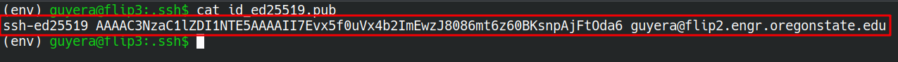
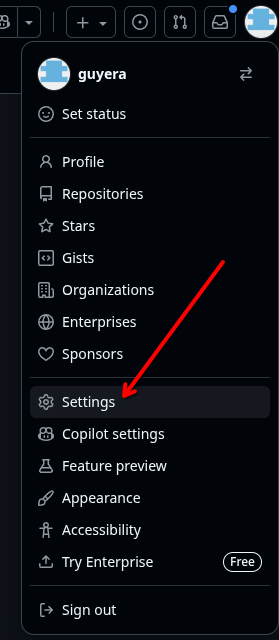
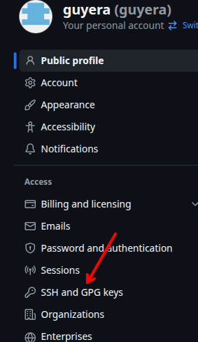
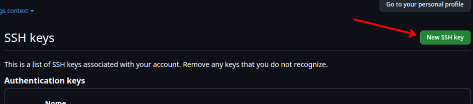
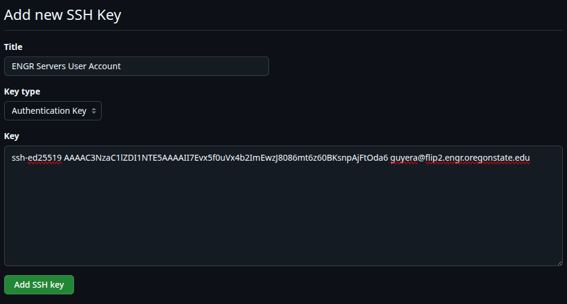
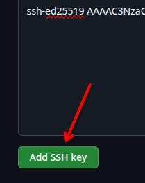
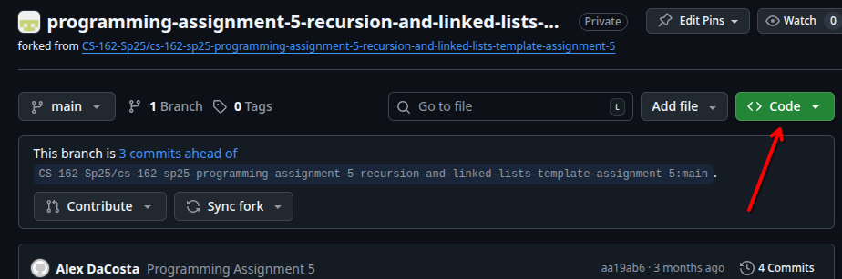
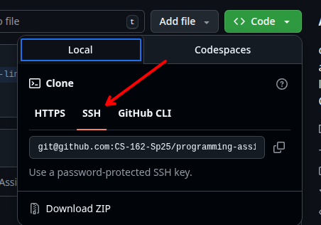
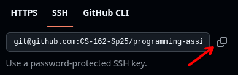

# Getting Started with Assignment 1: Git, GitHub, and “Hello, World!”

(If you don’t have any experience with shells / SSH, then it’s strongly
recommended that you wait until completing lab 1 before doing this
assignment. But if you want to get a head start anyways, refer to the
[lecture notes](https://guyera.github.io/cs-162/lecture-notes/) on
“Terminals, Shells, and SSH,” “Basic Bash Commands,” and “Vim.”)

## Context
In this assignment, you will learn how to securely access GitHub from remote
computers. You will use this to set up your ENGR environment to access
classroom assignments hosted on GitHub and configure Gradescope to have
access your repositories so it can download and run your code.

## Configuring SSH keys to authenticate with GitHub

Git is a version control system (VCS); its purpose is to help track and
control the version history of a digital project. It’s most commonly
used to version-control software systems. For example, it can be used to
share a codebase among teammates; summarize and review changes made
between two versions of a codebase; revert an entire codebase to a
previous state; and so on.

Version control is incredibly important in software engineering.
However, it’s a complicated subject, and we don’t have enough time to
cover it in great detail, so we’ll only discuss it in a limited form. In
this class, you’ll just use Git and to 1) download (clone) starter code
for labs and assignments, and 2) submit (push) your work.

Git organizes files into projects referred to as **repositories**. A Git
repository is basically just a folder that contains one or more files
whose changes are being tracked by Git. There are two main ways to
create a Git repository:

1.  Download an existing Git repository from a remote Git repository
    hosting platform like GitHub (e.g., via `git clone`)

2.  Initialize a brand new Git repository locally (e.g., via `git init`)

You only need to understand the first method for this course.
Particularly, most assignments and labs come with some starter code in
the form of a Git repository generated by GitHub Classroom and hosted on
GitHub. To complete each assignment and lab, you’ll accept the
assignment / lab on GitHub Classroom to generate your personal Git
repository on GitHub; clone (download) that Git repository from GitHub
into a directory (folder) on the engineering servers within an SSH
session; use `vim` to complete the starter code that came with the
repository; push (upload) your changes back to GitHub; and finally submit
your GitHub repository in Gradescope.

This assignment will teach you how to do these things. To start,
complete the below steps:

1.  Create an account on [GitHub](https://www.github.com) if you don’t
    already have one. You do <ins>not</ins> have to include personally
    identifiable information in your GitHub username or profile if you
    don’t want to, and you do <ins>not</ins> have to use your OSU email
    address if you don’t want to.

2.  Log in to your GitHub account.

3.  In order to download repositories from your GitHub account to the
    engineering servers (and upload your completed work back to GitHub),
    you’ll need to be able to authenticate your engineering server user
    account with GitHub. SSH keys are the most common authentication
    method for remote Git repository operations. In an SSH session on
    the engineering servers, generate a pair of SSH keys by executing
    the following shell command:

    `ssh-keygen -t ed25519`

    Follow the on-screen instructions. When asked where you would like
    to store your SSH key files, simply press enter to store them in the
    default location (it’s possible to store them elsewhere, but that’s
    complicated and requires extra configuration). It will also ask you
    for an SSH passphrase. This is the password that you’ll type in
    whenever you want to use your SSH keys to authenticate with GitHub.
    Don’t forget it. If you forget it at any point, you’ll need to redo
    all the steps in this assignment to generate and configure a new
    pair of keys.

4.  Use `cd` to navigate to your home directory on the ENGR servers if
    you’re not already there.

5.  Type `cd .ssh` and press enter. This will navigate you into the
    (hidden) `.ssh` directory, which resides within your home directory.

6.  Type `ls`. You should see the two SSH key files that you just
    generated. They should be named `id_ed25519` and `id_ed25519.pub`.

    (The former is the private key, and the latter is the public key.
    The private key is used to generate cryptographic signatures, and
    the public key is used to verify signatures generated by the private
    key. The goal of the next few steps is to upload the public key into
    your GitHub account so that it can verify “login” (identity
    authentication) attempts that use the private key, allowing you to
    download and upload Git repositories associated with your GitHub
    account from within an SSH session on the ENGR servers).

7.  Type `clear` and press enter. Then type `cat id_ed25519.pub` and
    press enter again. This will print the contents of your public key
    file to the terminal. Copy the <ins>entire</ins> printed contents to
    your clipboard (do not copy the “`cat id_ed25519.pub`” command
    string itself; just copy everything that was printed below it). It
    should start with “`ssh-ed25519`” and end with your current SSH
    connection string. Remember: you can usually copy terminal text to
    the clipboard by highlighting it and pressing `Ctrl+Shift+C`.

    For example, mine looks like this:

    

8.  Go back to your browser where you’re logged into your GitHub
    account. Click on your profile icon in the topright corner. Click
    “Settings.”

    

9.  On the left, click “SSH and GPG keys”.

    

10. Click “New SSH key.”

    

11. Give the SSH key a title (e.g., "ENGR servers user account"). Leave
    the key type as “Authentication Key”. In the "Key" field, paste the
    public key contents that you copied in the previous step. For
    example, mine looks like this:

    

12. Click “Add SSH key”.

    

13. Now that your GitHub account has a copy of your public key, it can
    verify signatures generated by your private key on the ENGR servers.
    Whenever you use `git` commands in an SSH session on the ENGR
    servers, it will sign its messages using the private key
    (`~/.ssh/id_ed25519`) by default. In other words, you should
    now be able to use `git` commands on the ENGR servers to "log in" to
    your GitHub account and upload / download repositories.

    Let’s test that your SSH keys are set up correctly. In your terminal
    connected to the ENGR servers, run the following command:

        ssh -T git@github.com

    It should print a message about successfully connecting but not
    being provided shell access. For me, it looks like this:

        Hi guyera! You've successfully authenticated, but GitHub does not
        provide shell access.

    If it prints an error message instead, then you likely made a
    mistake in one of the previous steps, and you’ll have to redo them.
    In such a case, before redoing the steps, I recommend checking your
    `.ssh` directory to see if it has any other SSH keys in it. If you
    have several pairs of SSH keys (e.g., because you already had some
    before you started this assignment), it’s possible that the SSH
    client is using the wrong ones. In that case, a foolproof solution
    would be to delete all the SSH keys (e.g., via the `rm` command)
    before redoing the above steps.

## Configuring Git on the ENGR servers

Git is installed on the ENGR servers, but it requires a small amount of
configuration. If you haven’t already configured Git on the ENGR
servers, then complete the following steps:

1.  Execute the following command:

    ```
    git config --global user.name "<INSERT NAME HERE>"
    ```

    Replace `<INSERT NAME HERE>` with your name (but keep the quotation
    marks). For example:

    ```
    git config --global user.name "Alexander Guyer"
    ``` 

2.  Execute the following command:

    ```
    git config --global user.email "<INSERT EMAIL ADDRESS HERE>"
    ```

    Replace `<INSERT EMAIL ADDRESS HERE>` with the email address
    associated with your GitHub account (again, keep the quotation
    marks). For example:

        git config --global user.email "guyera@oregonstate.edu"

## Cloning an assignment repository

Now that you can authenticate with GitHub from the ENGR servers and Git
is properly configured, you can use `git` shell commands to download
starter code for assignments and labs. Complete the following steps:

1.  The Canvas page for this assignment provides a link to a GitHub
    Classroom assignment. Click that link and follow the on-screen instructions
    to accept the assignment. It will generate a GitHub repository for you
    containing the starter code for this assignment.

2.  You may encounter an error message telling you that you don't have
    access to your assignment repository that was just generated. Check your
    email; you should have gotten an email from GitHub with an invitation to
    the repository. Accept the invitation. It should then load the repository's
    main page automatically.

    If you don't see the email, check your junk / spam.

    If you still don't see it, you should be able to find the invitation
    directly in GitHub $\rightarrow$ profile icon at the top right of the
    page $\rightarrow$ Organizations.

    If you can't find it there either, please email the TA mailer or stop
    by office hours for help.

3.  You should now be on the main page of your GitHub repository, which should
    look similar to this one. You should see some additional assignment
    instructions (ignore them for now; we'll get to them momentarily).

    > **Note:** This new repository is owned by you. However, it's nested
    within our class’s GitHub Organization, meaning that the TAs and
    instructor have access to it as well. Other students do not have
    access to it.

    On your generated repository's main page, you should see a green button
    that says “`<> Code`”. Click that button.

    

4.  Select the “SSH” tab in the small popup window (it might already be
    selected).

    

5.  Click the copy icon to the right of the SSH URL to copy the
    repository’s SSH URL to your system’s clipboard (the icon looks like
    a pair of squares overlaid on top of one another).

    

6.  In your terminal connected to the ENGR servers, type `cd` and press
    enter to navigate to your home directory. From there, use tools like
    `ls` and `cd` to navigate to the directory in which you’d like to
    store your assignment work for this class (e.g.,
    `cs162/assignments`). Remember: you can create new directories with
    the `mkdir` shell command.

7.  Run the following shell command:

    ```
    git clone PASTE_SSH_URL_HERE
    ```

    Replace `PASTE_SSH_URL_HERE` with the SSH URL that you copied to
    your clipboard a moment ago. Remember: You can usually paste into
    your terminal via `Ctrl+Shift+V`.

8.  Running the above command should have downloaded a copy of (i.e.,
    “cloned”) your Git repository into a new directory on the ENGR
    servers. Type `ls` and press enter. You should now see that newly
    generated assignment directory.

9.  Navigate into your cloned assignment directory using `cd`.

10. Type `git status` and press enter. This command can be executed from
    within any directory that represents a Git repository, such as those
    generated by downloading a remote repository via `git clone` (as is
    the case with this directory).

    You should be presented with a bit of information about the Git
    repository. If you instead see an error (e.g.,
    “`fatal: not a git repository`”), then you likely made a mistake in
    one of the previous steps, and you’ll have to redo them. But as a
    first step, I recommend running `pwd` to check what directory you're
    currently in; it could just be that you're not inside your assignment
    directory.

You're not done yet! The remaining instructions for this assignment can be
found on the main page of your generated GitHub repository. Continue with
those instructions to complete the assignment and submit it to Gradescope.

# Acknowledgements
author: Alexander Guyer (<guyera@oregonstate.edu>), CS 162
